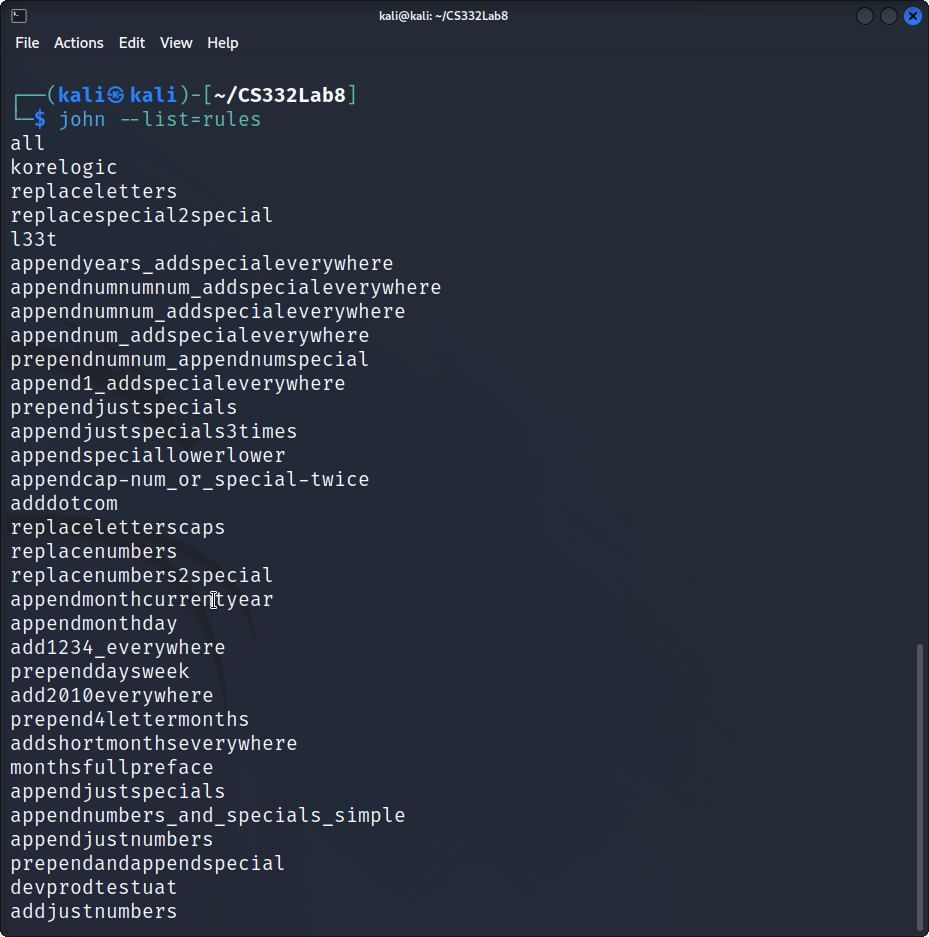

# LAB 8 - Post Exploitation/Cracking Hashes

1. On your Kali machine, open a terminal window and browse to the location of the `user_logins.txt` file. 

2. John the Ripper has a bunch of rules for common password permutations based on usernames that could potentially crack some of the passwords. To list the available rule list type the following command: 

	`john --list=rules`

	```
all
korelogic
replaceletters
replacespecial2special
l33t
appendyears_addspecialeverywhere
appendnumnumnum_addspecialeverywhere
appendnumnum_addspecialeverywhere
appendnum_addspecialeverywhere
prependnumnum_appendnumspecial
append1_addspecialeverywhere
prependjustspecials
appendjustspecials3times
appendspeciallowerlower
appendcap-num_or_special-twice
adddotcom
replaceletterscaps
replacenumbers
replacenumbers2special
appendmonthcurrentyear
appendmonthday
add1234_everywhere
prependdaysweek
add2010everywhere
prepend4lettermonths
addshortmonthseverywhere
monthsfullpreface
appendjustspecials
appendnumbers_and_specials_simple
appendjustnumbers
prependandappendspecial
devprodtestuat
addjustnumbers
append2numspecial
append3numspecial
append4numspecial
prepend4numappendspecial
append2letters
prependspecialspecialappendnumbersnumbernumber
prependspecialspecialappendnumbersnumber
prependspecialspecialappendnumber
appendspecialnumbernumbernumber
appendspecialnumbernumber
prependspecialspecial
prepend2numbersappend2numbers
prependnumnumspecial
prependnumnumnumnum
prependnumnumnum
prependnumnum
prependnumnumappendspecial
prependcapcapappendspecial
appendspecial4num
appendspecial3num
append6num
append5num
append4num
appendcurrentyearspecial
appendyears
prependyears
prependhello
appendseason
prependseason
jumbo
unicodesubstitution
upperunicodesubstitution
lowerunicodesubstitution
single-extra
loopback
passphrase-rule2
passphrase-rule1
hashcat
specific
rockyou-30000
t0xlc
insidepro
dive
d3ad0ne
best64
t9
oi
i
i3
i2
i1
o
o3
o2
o1
oldoffice
split
phrasewrap
phrasecaseone
phrase
phrasepreprocess
multiword
shifttoggle
nt
wordlist
extra
single
jumbosingle
drop
none
	```

3. What is the output of the command? (include screenshot).



4. Use the the "--single" rule to crack the hashes by using the following command: 

	`john --single user_logins.txt`

	```
john --single user_logins.txt
 
Warning: detected hash type "md5crypt", but the string is also recognized as "md5crypt-long"
Use the "--format=md5crypt-long" option to force loading these as that type instead
Using default input encoding: UTF-8
Loaded 7 password hashes with 7 different salts (md5crypt, crypt(3) $1$ (and variants) [MD5 256/256 AVX2 8x3])
Will run 2 OpenMP threads
Press 'q' or Ctrl-C to abort, almost any other key for status
user             (user)     
postgres         (postgres)     
msfadmin         (msfadmin)     
service          (service)     
Almost done: Processing the remaining buffered candidate passwords, if any.
4g 0:00:00:01 DONE (2022-11-05 23:11) 2.061g/s 3587p/s 3619c/s 3619C/s sdev1903..dsys1900
Use the "--show" option to display all of the cracked passwords reliably
Session completed.

john --show user_logins.txt
 
msfadmin:msfadmin:1000:1000:msfadmin,,,:/home/msfadmin:/bin/bash
postgres:postgres:108:117:PostgreSQL administrator,,,:/var/lib/postgresql:/bin/bash
user:user:1001:1001:just a user,111,,:/home/user:/bin/bash
service:service:1002:1002:,,,:/home/service:/bin/bash

4 password hashes cracked, 3 left
	```

5. What is the password for the following users:

	|Username	|Password	|
	|---------------|---------------|
	|user		|user		|
	|msfadmin	|msfadmin	|		
	|service	|service	|
	|postgres	|postgres	|

6. While John the ripper did reveal the password for some of the users using the "single" rule, it did not crack the password for all the users. We will now use a dictionary list to crack even more passwords. 

7. Type the following command:

	`john --wordlist=/usr/share/john/password.lst --rules user_logins.txt`

8. What does the `--wordlist=/usr/share/john/password.lst` do? 

	Uses `password.lst` as the word list of passwords that we will use when running the crack from john. John provides this file and the option `--wordlist` reads words from FILE or using --stdin.

9. What does the `--rules` option do?

	Specify the rules used for word mangling, or if no option specified then the default rules are ran from `/etc/john/john.conf`. You may have to specify the rules on the command line and rules requires the option `--wordlist`.

10. What is the password for 'sys' user? 

	batman

11. What is the password for 'klog' user?

	123456789

12. What command would you use to have john display all the passwords you have cracked for user_logins.txt?

	`john --show user_logins.txt`
	```                                         
sys:batman:3:3:sys:/dev:/bin/sh
klog:123456789:103:104::/home/klog:/bin/false
msfadmin:msfadmin:1000:1000:msfadmin,,,:/home/msfadmin:/bin/bash
postgres:postgres:108:117:PostgreSQL administrator,,,:/var/lib/postgresql:/bin/bash
user:user:1001:1001:just a user,111,,:/home/user:/bin/bash
service:service:1002:1002:,,,:/home/service:/bin/bash

6 password hashes cracked, 1 left
	```
